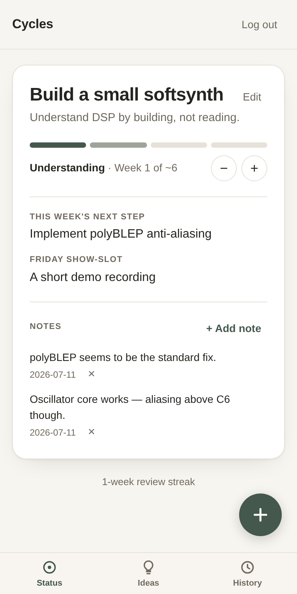
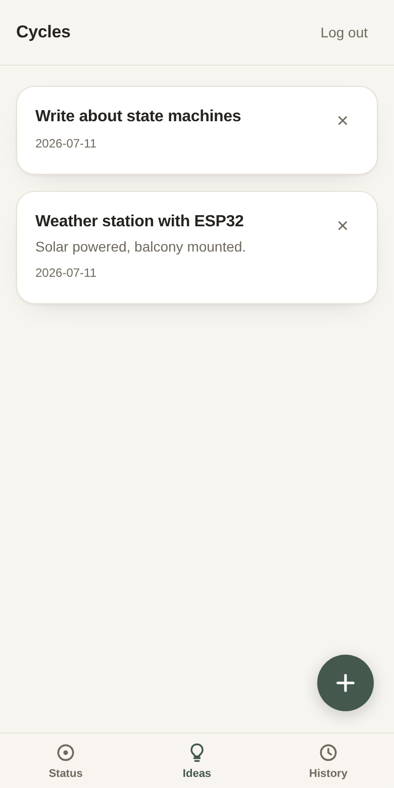

# Cycle Companion

A planning tool for process people. The core object is a project cycle
(~6–12 weeks), not a todo list. See [`SPEC.md`](./SPEC.md) for the full
product spec — this README covers features at a glance, setup and
deployment.

## Features

| Status view | Idea backlog |
|:---:|:---:|
|  |  |

- **One cycle at a time.** A cycle moves through four phases —
  *building → understanding → showing → completed* — enforced by a
  server-side state machine. The segmented bar shows the **phase**, not
  elapsed time; "week N of ~M" below it is the time dimension, and the
  tilde is deliberate: `target_weeks` is a living estimate you adjust
  with one tap (−/+), not a commitment.
- **Shown, or buried — never vanished.** Completing requires a public
  artifact URL and a brain-dump; abandoning ("burying") requires a
  brain-dump too. The history view keeps all of it.
- **Progress notes.** One-tap notes on the active cycle act as
  distributed brain-dumping; they resurface as source material when the
  cycle ends and as context during the weekly review.
- **Guided Sunday review.** Always the same short question sequence,
  one question per screen. *This week's next step* and the *Friday
  show-slot* on the status view are the answers from the latest review —
  the ritual is the only place they get written.
- **Idea backlog.** A "+" captures an idea in seconds so it can stop
  occupying your head. Deciding happens only at cycle boundaries: when
  no cycle is active, open ideas are offered as candidates and promote
  into a prefilled new cycle. No tags, no priorities — deliberately.
- **Quarterly review.** Unlocks every 12 weeks: big parked life
  questions plus a keep/discard sweep over ideas older than 12 weeks.
- **PWA + API-first.** Installable on iOS, offline shows the last-known
  status; every feature works via the JSON API alone
  ([`openapi.yaml`](./openapi.yaml)).

## Stack

- **Backend**: Go, stdlib `net/http` (Go 1.22+ routing), [pgx/v5](https://github.com/jackc/pgx)
  for Postgres. No ORM — hand-written SQL with an embedded, auto-applied
  migration runner (`internal/dbmig`).
- **Database**: PostgreSQL.
- **Web UI**: a small vanilla HTML/CSS/JS PWA (`web/static/`), embedded into
  the Go binary via `go:embed` and served from the same process as the API.
  No build step, no framework.
- **Deployment**: one Docker image, runs identically on Railway or locally
  via `docker compose`. No Railway-proprietary APIs in application code.

## Local development

### Option A — docker compose (closest to production)

```sh
cp .env.example .env   # then edit CYCLE_PASSWORD if you want a real one
CYCLE_PASSWORD=changeme docker compose up --build
```

The app is at http://localhost:4715. Postgres runs in its own container
with a named volume, migrations run automatically on startup.

### Option B — native Go, for fast iteration

Requires a local Postgres reachable via `DATABASE_URL`.

```sh
createdb cycles
export DATABASE_URL="postgres://<user>@localhost:5432/cycles?sslmode=disable"
export CYCLE_PASSWORD=changeme
export COOKIE_SECURE=false   # allow the session cookie over plain HTTP locally
go run ./cmd/server
```

### Driving it with curl

```sh
BASE=http://localhost:4715
curl -c cookies.txt -X POST $BASE/auth/login -d '{"password":"changeme"}'
curl -b cookies.txt -X POST $BASE/cycles -d '{"title":"Learn Rust","target_weeks":6}'
curl -b cookies.txt $BASE/status
```

Full endpoint list: [`openapi.yaml`](./openapi.yaml).

## Environment variables

| Variable | Required | Notes |
|---|---|---|
| `DATABASE_URL` | yes | Postgres connection string. Railway injects this automatically when a Postgres service is attached. |
| `CYCLE_PASSWORD` | yes | The single-user login password. No default — the server refuses to start without it. |
| `PORT` | no | Defaults to `4715`. Railway injects this automatically. |
| `COOKIE_SECURE` | no | Defaults to `true`. Set to `false` only for local HTTP development. |

## Deploying to Railway

The repo builds from its `Dockerfile`; `railway.json` sets the healthcheck
path (`/health`) and restart policy. Nothing Railway-specific lives in the
application code — the same image runs anywhere.

### Via the Railway CLI

```sh
npm install -g @railway/cli    # or: curl -fsSL https://railway.app/install.sh | sh
railway login
railway init                   # creates a new Railway project
railway add --database postgres
railway up                     # builds the Dockerfile and deploys
railway variables --set CYCLE_PASSWORD=<a real password>
railway domain                 # generates a public URL
```

`DATABASE_URL` is wired automatically once a Postgres service is attached in
the same project — no manual copying of connection strings.

### Via the Railway dashboard

1. New Project → Deploy from GitHub repo (this repo).
2. Add a PostgreSQL database to the same project (Railway sets
   `DATABASE_URL` on the app service automatically).
3. On the app service, set the `CYCLE_PASSWORD` variable.
4. Deploy. Railway builds the `Dockerfile` and uses `/health` for the
   healthcheck.
5. Generate a public domain under the app service's Settings → Networking.

### Verifying a deploy

```sh
curl https://<your-app>.up.railway.app/health
```

## Project layout

```
cmd/server/          entrypoint: config, DB connect+retry, migrations, HTTP server
internal/config/      env var loading
internal/db/          Postgres connection pool
internal/dbmig/        embedded SQL migrations, applied automatically on startup
internal/model/        shared domain types
internal/auth/         single-user auth, Postgres-backed sessions, login rate limiting
internal/cyclesvc/      Cycle CRUD + state machine
internal/reviews/       weekly/quarterly review persistence, due/streak logic
internal/questions/     parked "big life questions"
internal/ideas/         idea backlog (capture bin) + promote-to-cycle
internal/httpapi/       HTTP routing, handlers, JSON responses
web/                    go:embed wrapper around web/static
web/static/             the PWA: index.html, app.js, style.css, manifest, service worker, icons
openapi.yaml            full API spec
Dockerfile              multi-stage build, used both by Railway and docker compose
docker-compose.yml      app + Postgres for local dev
railway.json            Railway build/deploy config (healthcheck, restart policy)
```

## PWA install

Visit the deployed URL on iOS Safari → Share → Add to Home Screen. On
desktop Chrome/Edge, the install icon appears in the address bar. Offline,
the app shell loads from cache and shows the last-known `/status`; writes
(reviews, cycle edits) require connectivity.
