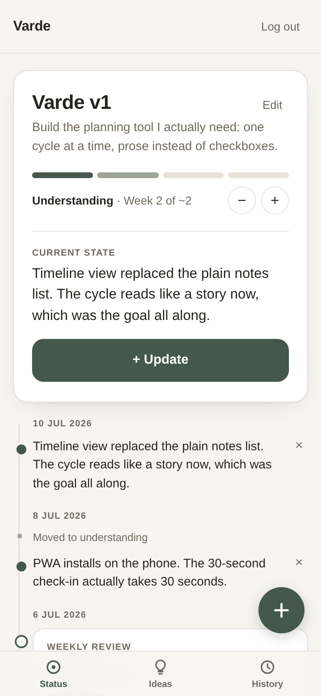
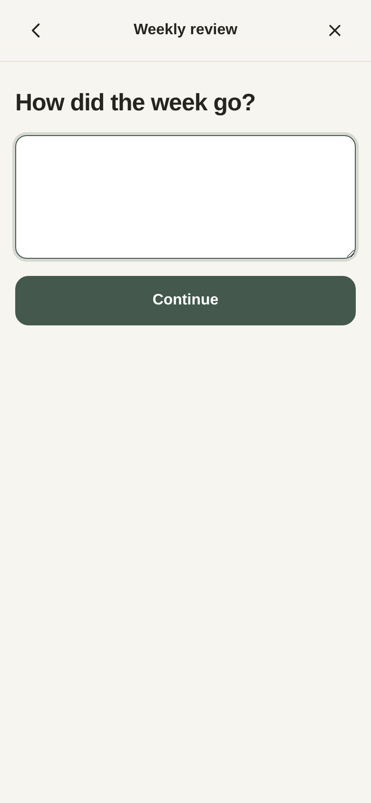
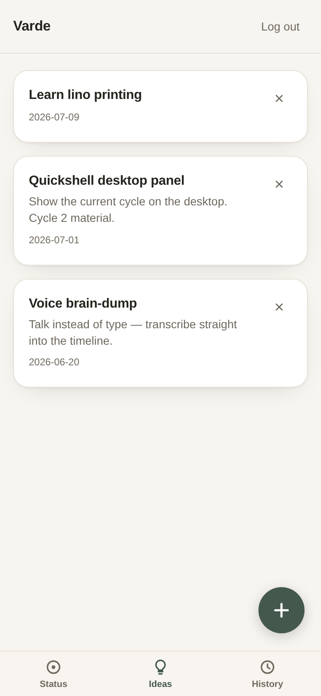
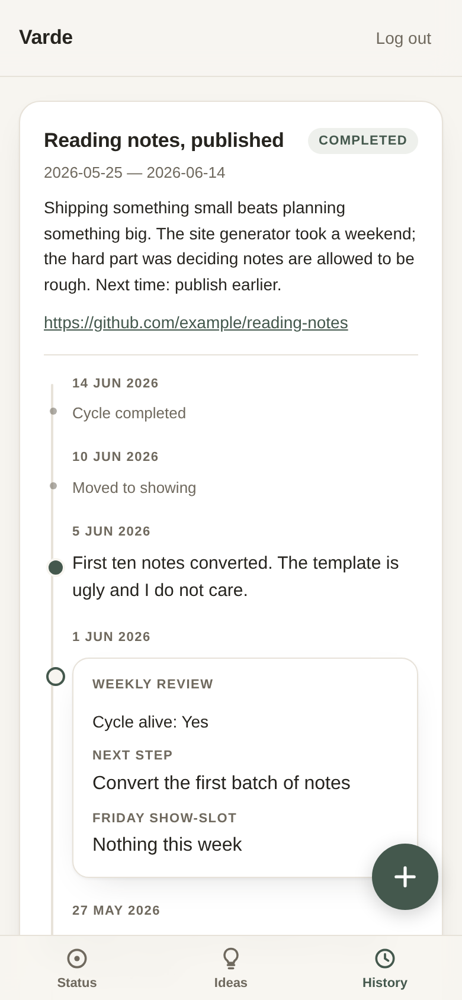
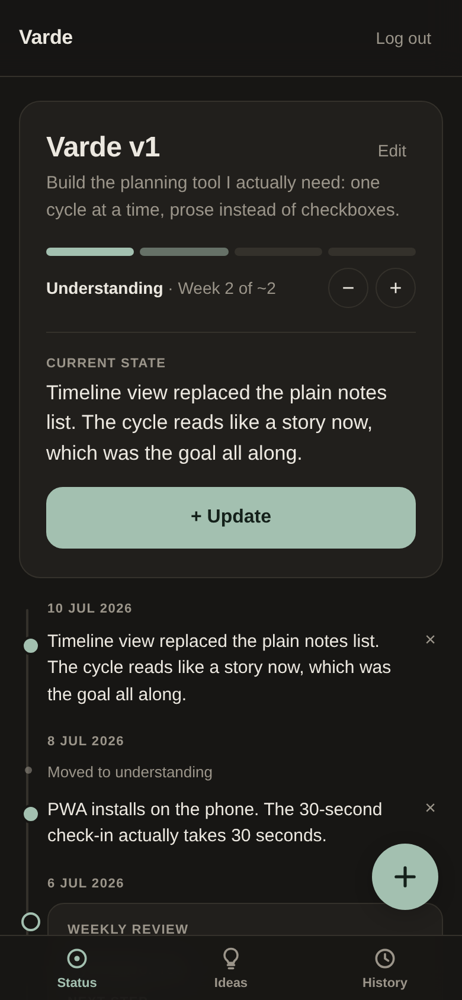

# Cycle Companion

[](https://railway.com/new/template/XlS7kq?utm_medium=integration&utm_source=button&utm_campaign=cycle-companion)

A planning tool for people whose fulfillment comes from the process of
building and understanding, not from finished things. Instead of a todo
list it tracks one **project cycle** at a time — a few weeks of building
something, writing prose updates along the way, and ending each cycle
either *shown* (a public artifact exists) or deliberately *buried* (with
a short note on what was learned). I built it for myself because every
task manager I tried turned my projects into guilt. This one is a quiet
companion, not a dashboard.

This is a personal project. It's single-user by design, the scope is
deliberately small, and the [SPEC.md](./SPEC.md) it was built from lives
in the repo as the design doc.

## What it looks like

| Status — the cycle timeline | Sunday review — one question at a time |
|:---:|:---:|
|  |  |

| Idea backlog | History — every cycle keeps its story |
|:---:|:---:|
|  |  |

Dark mode follows the system:



## Deploy your own on Railway

The button above sets up everything on [Railway](https://railway.com) —
you don't need to know Railway to use it. What happens when you click it:

1. Railway creates a project with two services: **the app** (built from
   this repo's Dockerfile) and a **PostgreSQL database**. The database
   connection (`DATABASE_URL`) is wired up automatically.
2. You'll be asked for one variable: **`CYCLE_PASSWORD`** — the password
   you'll log in with. Pick something real; this is the entire auth of a
   single-user app.
3. The app starts, runs its database migrations automatically, and
   Railway checks `/health` until it's green.
4. Generate a public domain for the app service (Settings → Networking),
   open it on your phone, log in, and add it to your home screen — it
   installs as an app (PWA).

Running it costs whatever a small always-on service plus Postgres costs
on your Railway plan; there is nothing else to configure.

<details>
<summary>Deploying manually instead (CLI or dashboard)</summary>

Via the [Railway CLI](https://docs.railway.com/cli/installation):

```sh
railway login
railway init                   # creates a new Railway project
railway add --database postgres
railway up                     # builds the Dockerfile and deploys
railway variables --set CYCLE_PASSWORD=<a real password>
railway domain                 # generates a public URL
```

Via the dashboard: New Project → Deploy from GitHub repo → add a
PostgreSQL database to the same project → set `CYCLE_PASSWORD` on the
app service → deploy → generate a domain under Settings → Networking.
`DATABASE_URL` is injected automatically once Postgres is attached;
`railway.json` in this repo configures the `/health` healthcheck and
restart policy.

</details>

## The rules it enforces

Three ideas carry the whole app — the [SPEC](./SPEC.md) has the full
reasoning:

- **Cycles, not tasks.** The core object is a project cycle (a few
  weeks), tracked as a vertical timeline of prose updates. There are no
  tasks, no due dates, no checkboxes anywhere. Progress is written down,
  not ticked off.
- **Shown, or buried — never vanished.** A cycle only counts as
  completed when it points at a public artifact (repo, post, video) and
  ends with a brain-dump. Abandoning is allowed too, but also requires a
  brain-dump. The history view keeps every cycle's full timeline,
  read-only: nothing evaporates.
- **Parked, not suppressed.** New ideas mid-cycle go into a capture bin
  in seconds (no tags, no priorities — deciding happens only at cycle
  boundaries). Big life questions get parked in a container that only
  opens at the quarterly review, so they stop running as background
  noise.

The rhythm around it: a guided Sunday review (same short questions every
week, one per screen) and a quarterly review that unlocks every 12
weeks.

## Local development

Requires Docker, or Go 1.22+ with a local Postgres.

### docker compose (closest to production)

```sh
cp .env.example .env   # then edit CYCLE_PASSWORD
CYCLE_PASSWORD=changeme docker compose up --build
```

The app is at http://localhost:4715. Postgres runs in its own container
with a named volume; migrations run automatically on startup.

### Native Go, for fast iteration

```sh
createdb cycles
export DATABASE_URL="postgres://<user>@localhost:5432/cycles?sslmode=disable"
export CYCLE_PASSWORD=changeme
export COOKIE_SECURE=false   # allow the session cookie over plain HTTP locally
go run ./cmd/server
```

### Environment variables

All of them are documented with placeholders in
[`.env.example`](./.env.example):

| Variable | Required | Notes |
|---|---|---|
| `DATABASE_URL` | yes | Postgres connection string. Railway injects this automatically when a Postgres service is attached. |
| `CYCLE_PASSWORD` | yes | The single-user login password. No default — the server refuses to start without it. |
| `PORT` | no | Defaults to `4715`. Railway injects this automatically. |
| `COOKIE_SECURE` | no | Defaults to `true`. Set to `false` only for local HTTP development. |

### Stack, in one breath

Go with stdlib `net/http` and hand-written SQL on Postgres (embedded
migrations, no ORM); the web UI is a small vanilla HTML/CSS/JS PWA
embedded into the binary via `go:embed` — no build step, no framework.
One Docker image runs identically on Railway and locally; nothing
Railway-specific lives in the application code.

## API

The app is API-first: everything the UI does works via the JSON REST API
alone (curl-able), so future clients — a desktop panel, a voice thing —
can reuse it. The full surface is described in
[`openapi.yaml`](./openapi.yaml).

```sh
BASE=http://localhost:4715
curl -c cookies.txt -X POST $BASE/auth/login -d '{"password":"changeme"}'
curl -b cookies.txt -X POST $BASE/cycles -d '{"title":"Learn Rust","target_weeks":2}'
curl -b cookies.txt $BASE/status
curl -b cookies.txt -X POST $BASE/cycles/<cycle-id>/entries -d '{"text":"Chapter 4 done, ownership finally clicks"}'
```

## License

[MIT](./LICENSE)
